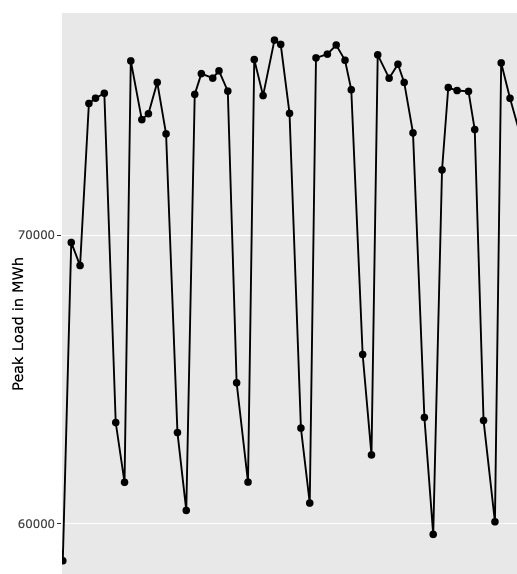

## Overview of Plots from peaks
**Plots of all peaks from 2015 to 2024**

{width=80%}

**Zoom in one examplary week**

{width=65%}

## VAR Modelling

```{r, message=FALSE}
library(tidyverse)
library(scoringRules)
library(vars)
library(ggplot2)
library(plotly)
```

```{r}
# --- Load the energy data ---
energy_load <- read.csv("../data/load_22-24.csv")
energy_load$date <- as.POSIXct(energy_load$date, tz = "UTC")

# --- Getting the peaks ---
peaks <- energy_load |>
    group_by(as.Date(date)) |>
    slice(which.max(load))
```

```{r}
# --- Analysis for one year ---
peaks_2023 <- peaks |>
    filter(year(date) == 2023)

load <- peaks_2023$load

plot(load)
```

```{r}
acf(load, lag.max = 21)
```

! Time Series is not stationary -> VAR cannot be applied!!!

Differntiate time series to make it stationary

```{r}
peaks_2023_diff <- data.frame(date = peaks_2023$date[-(1:7)], load = diff(peaks_2023$load, 7), hour_int = peaks_2023$hour_int[-(1:7)])

plot(peaks_2023_diff$load)
acf(peaks_2023_diff$load, lag.max = 365)
```

VAR Model implemented!

Problem:

```{r}
plot(peaks_2023$hour_int)
```

## ARIMA Analysis: A

```{r}
peak_load <- peaks$load
# Difference the load peak with the duration of one week (7 days)
peak_load_diff <- diff(peak_load, 7)
```

```{r}
# Build an arima model
model <- arima(peak_load_diff, c(1, 0, 7), method = "ML")

# Plot the residuals
plot(residuals(model))
```

Error Learning Phase
```{r}
# --------- Error Learning phase ------------
# Extract the residuals from the model
resid <- data.frame(resid = as.vector(residuals(model)))
# Standardize the residuals
mu_resid <- model$coef["intercept"]
sigma_resid <- sqrt(model$sigma2)
resid <- resid |>
    mutate(resid_std = (resid - mu_resid) / sigma_resid)

# Plot the standardized resids
ggplot(resid, aes(resid_std)) +
    geom_histogram(bins = 100)

# Generate the Empirical Distribution Function for the resids
ecdf_arima <- ecdf(resid$resid_std)

plot(ecdf_arima)
```

Prediction Phase

```{r}
# ------- Prediction phase --------

# Define the inverse ECDF
# Input p is the probability and the return is the quantile
inverse_ecdf_arima <- function(p) {
    quantile(ecdf_arima, p, names = FALSE)
}

quantiles <- seq(0.01, 1, by = 0.01)
peak_load_predict_dist <- data.frame(quantiles = quantiles, values = rep(0, length(quantiles)))

# Get the point forecast for the next day and add the peak load from 7 days before (bc of differencing)
point_forecast_arima <- as.numeric(predict(model, n.ahead = 1)$pred) + tail(peak_load, n = 7)[1]

for (i in quantiles) {
    # Destandardize the error for the qunatile i
    quantile_resid <- (inverse_ecdf_arima(i) * sigma_resid) + mu_resid
    peak_load_predict_dist[peak_load_predict_dist$quantiles == i, "values"] <- point_forecast_arima + quantile_resid
}

# Plot the distribution
peak_load_predict_dist |>
    ggplot(aes(values, quantiles)) +
    geom_line()

peak_load_predict_dist[peak_load_predict_dist$quantiles == 0.9, "values"]
peak_load_predict_dist[peak_load_predict_dist$quantiles == 0.1, "values"]
```


## ARIMA Analysis: B

```{r}
load <- energy_load |>
    filter((year(date) == 2022)) |>
    select(date, load)

# Plot the load and the diff for visual analysis
plot(load)
acf(load$load, lag.max = 170)
```

Again: Time Series is not stationary

Thus, we apply differencing

```{r}
load_diff <- data.frame(date = load$date[-(1:169)], load = diff(diff(load$load, 1), 168))

plot(load_diff$load)
acf(load_diff$load, lag.max = 336)
```

```{r}
# Examplary plot of the load distribution per hour
hour <- 2
# Histogramm
load_diff |>
    filter(hour(date) == hour) |>
    ggplot(aes(load)) +
    geom_histogram()
# Time Series
load_diff |>
    filter(hour(date) == hour) |>
    ggplot(aes(x = 1:length(load), y = load)) +
    geom_point() +
    geom_line()
```

```{r}
# Examplary plot of the load distribution per hour
hour <- 11
# Histogramm
load_diff |>
    filter(hour(date) == hour) |>
    ggplot(aes(load)) +
    geom_histogram()
# Time Series
load_diff |>
    filter(hour(date) == hour) |>
    ggplot(aes(x = 1:length(load), y = load)) +
    geom_point() +
    geom_line()
```