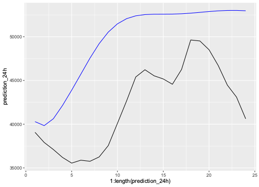
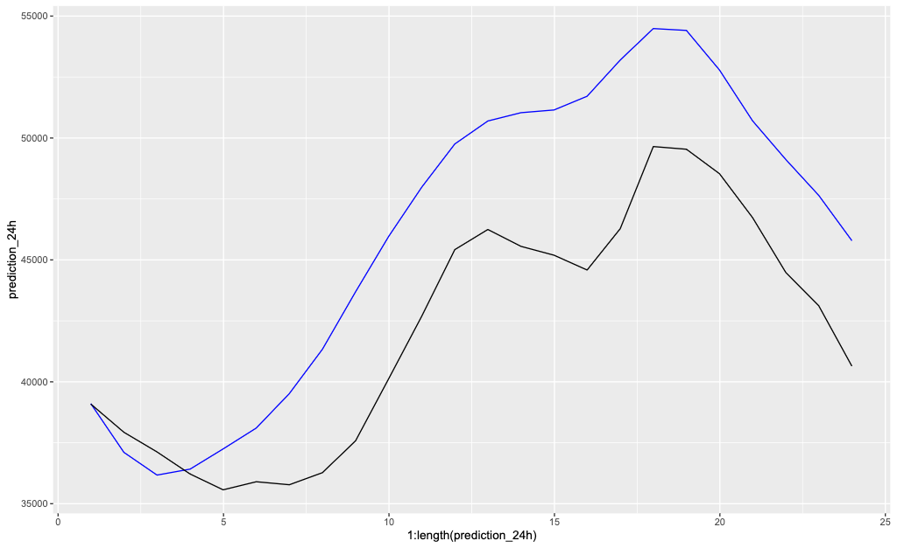

## Updates
- ARIMA Model in the multivariate framework did not work!

-> Forecasted time path is not realistic

-> Model Change is required!

    - Dummies instead of Differencing (working_day, month)
  

Based on the paper: Day-ahead electricity price forecasting with high-dimensional structures: Univariate vs. multivariate modeling frameworks

-> AR-Model

-> VAR-Model

## Overview of AR-Models for Load Path forecasting
Training period 2022-2023
Testing period 2024

**AR-12 + External Regressors (Working Day, Month)**

{width=80%}

**AR-24 + External Regressors (Working Day, Month)**

{width=80%}

## Overview of Machine Learning Model
Link to the Model: Neuralprophet (https://neuralprophet.com/)

**Neural Network in Sample Fit**

{width=80%}

**Neural Network Forecast**

{width=80%}