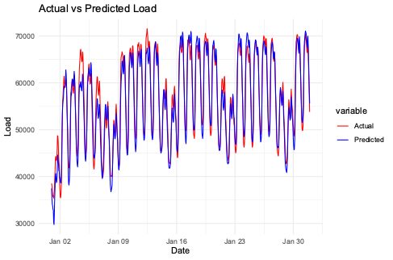

# Updates

- Log Transformation

{width=80%}

# CRPS-Scores für beide Modellierungsvarianten

Das Jahr 2022 wurde für das Training verwendet. Das Jahr 2023 - 2024 für Learning Phasen (365 Tage) und Prediction (100 Tage)

## Approach A: Predicting the peaks

### AR-7

{width=80%}

{width=80%}

CRPS: 1174.731

### ARIMA (1,1,1)

{width=80%}

{width=80%}

CRPS: 1323.244

## Approach B: Predicting the load

### AR-24

**With hourly dummy**

{width=80%}

**Without hourly dummy**

{width=80%}

{width=80%}

CRPS: 1545.942

### ARIMA

{width=80%}

{width=80%}

{width=80%}

{width=80%}

CRPS: 1293.818

### Expert Model

{width=80%}

**Model 10**

{width=80%}

**Model 11**

{width=80%}

**Model 18**

{width=80%}

CRPS: 1183.65