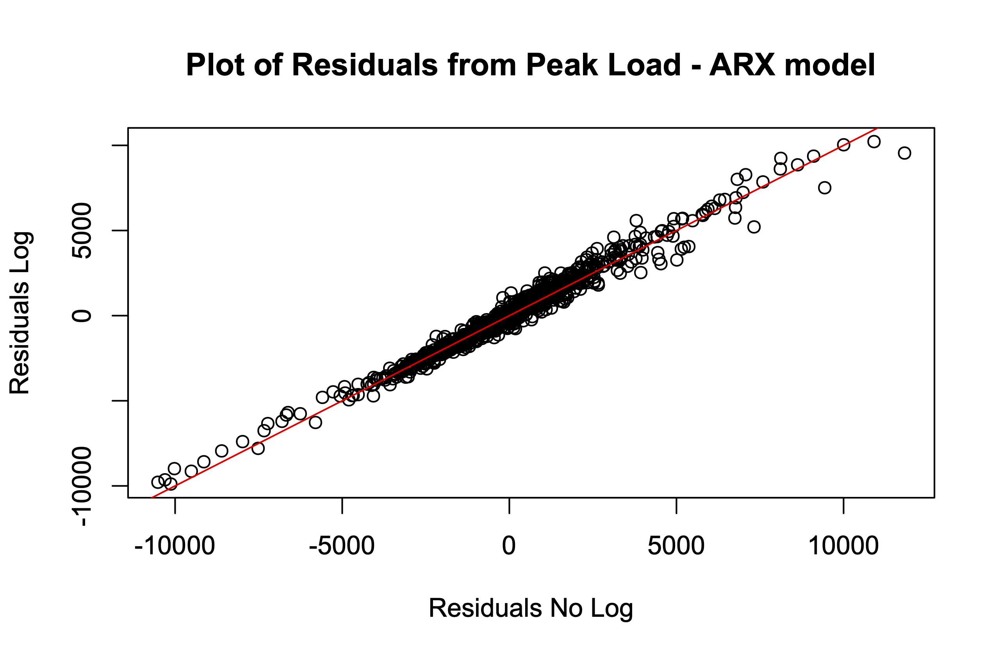
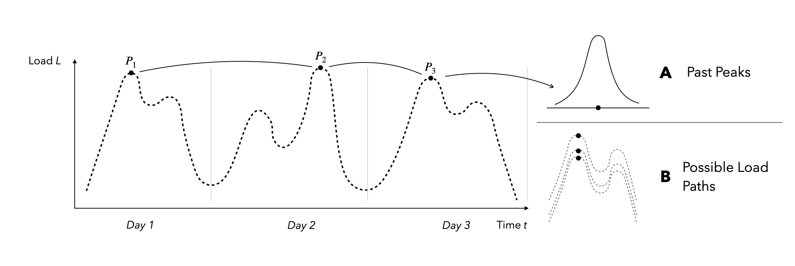
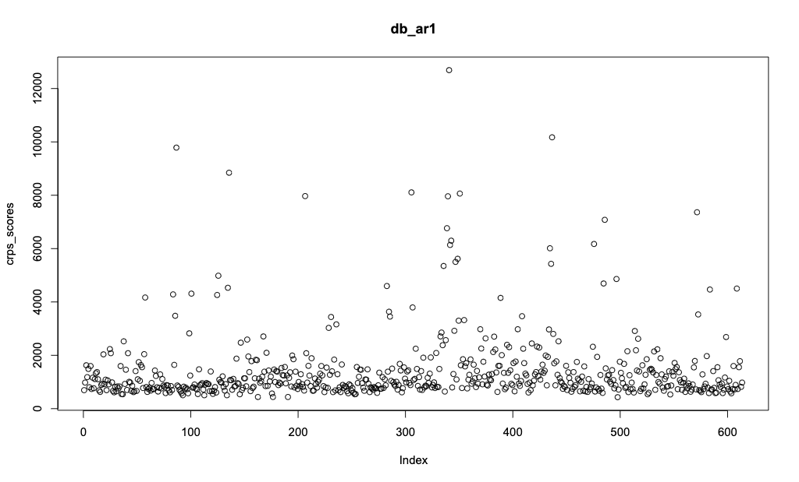

# Updates

- Log Transformation of load for the peak load ARX Model
{width=80%}

-  Shaake Shuffle (Grothe et al. 2023), Seite 10, $\sigma_{t,h} = 1$ im "raw-error" case - Warum?

# Problem Statement

<center>
Predicting the energy peak demand for the next 24 hours!
</center>

{width=80%}

We consider the data structure a *(DSA)* and the data structure B *(DSB)*

# Models
<center>
$P_d = \hat{P_d} + \epsilon_d \Leftrightarrow F_{P_d}^{-1}(q) = \hat{P_d} + F_{\epsilon_t}^{-1}(q)$
</center>

## Point Based Models
One year for training the model and 182 days to learn the error distribution.

1. ARIMA (pb_arima) - *DSA*
2. AR7 (pb_ar7) - *DSA*
3. Random Forest (pb_rf) - *DSA*

## Distribution Based  Models

1. Historical Simulation (db_hist_sim) - *DSA, DSB*
2. Quantile Regression Averaging (db_qra) - *DSA*
3. Load Path Simulation - AR1 (db_ar1) - *DSB*
4. Shaake Shuffle (db_ss_ar7, db_ss_arima, db_ss_rf - *DSB*

# Results
$n = 614$
```{r echo=FALSE, results='axis'}
library(knitr)
# Read the crps means
crps_means <- read.csv("../plots/results/crps_means.csv")
kable(crps_means, caption = "CRPS Means")
```


## CRPS Plots

{width=80%}
.png){width=80%}
.png){width=80%}
.png){width=80%}
.png){width=80%}
.png){width=80%}
.png){width=80%}
.png){width=80%}
.png){width=80%}

## Variance of Peak Distribution

.png){width=80%}

## PIT

.png){width=80%}
.png){width=80%}
.png){width=80%}
.png){width=80%}
.png){width=80%}
.png){width=80%}
.png){width=80%}
.png){width=80%}
.png){width=80%}

## UC
```{r echo=FALSE, results='axis'}
library(knitr)
# Read the us
crps_means <- read.csv("../plots/results/uc.csv")
kable(crps_means, caption = "Unconditional Coverage for several nominal coverages (NC)")
```